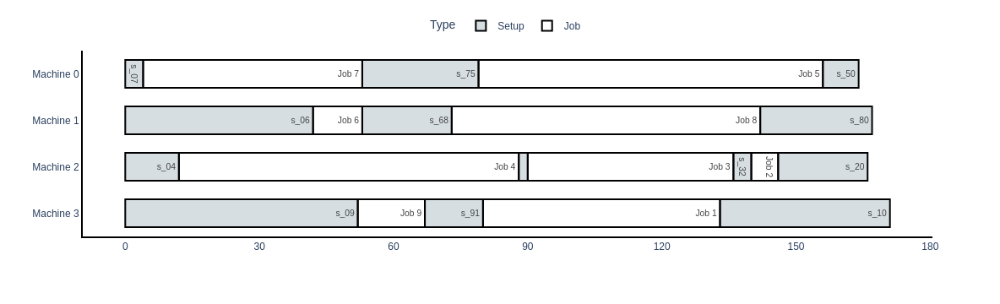
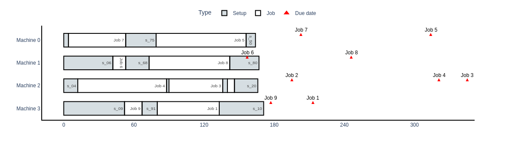
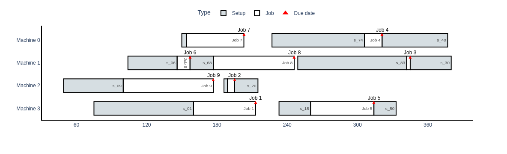

# Parallel Machine Scheduling Problem with Sequence-Dependent Setup Times

A REST API for solving the **Unrelated Parallel Machine Scheduling** problem with sequence-dependent setup times, optimizing either makespan (C_max) or the sum of earliness and tardiness.

## The Problem

This project addresses two related scheduling problems, denoted in standard three-field notation as **R|s<sub>ijk</sub>|C_max** and **R|s<sub>ijk</sub>, d<sub>j</sub>|∑(E<sub>j</sub> + T<sub>j<sub>)**:

| Field | Meaning |
|-------|---------|
| **R** | Unrelated parallel machines — each machine may process jobs at a different speed |
| **s<sub>ijk</sub>** | Sequence-dependent setup times — setup duration depends on both the machine and the pair of consecutive jobs |
| **d<sub>j</sub>** | Due date for job _j_ |
| **C<sub>max</sub>** | Objective: minimize makespan |
| **∑(E<sub>j</sub> + T<sub>j</sub>)** | Objective: minimize the total earliness and tardiness across all jobs |

Both problems share the same base structure: a set of jobs must each be assigned to exactly one machine from a set of unrelated parallel machines, where processing times are machine-dependent and setup times depend on both the machine and the sequence in which jobs are processed. In the **C<sub>max</sub>** variant, the goal is to find the job assignment and sequencing that minimizes the makespan. The **∑(E<sub>j</sub> + T<sub>j</sub>)** variant extends this by introducing due dates _d<sub>j</sub>_ for each job, with the goal of minimizing the total earliness and tardiness incurred across all jobs.

---

## Mathematical Model

The optimization models are formulated as Mixed-Integer Programs (MIP). A complete LaTeX document describing the formulations is included in this repository: [`model.tex`](./model.tex). The document also presents computational results and discusses the model's performance on a set of test instances.

The makespan model uses **lazy constraints** to handle the sub-tour elimination constraints. These are constraints whose full set is exponentially large but which can be enforced incrementally: the solver is run, if any violated constraint is identified, it is added to the model, and the solver is re-run. This process repeats until no violation is found.

> In **Julia + JuMP**, lazy constraints can be declared natively.
> In **Python + Pyomo**, since no native lazy constraint callback interface was found, the approach implemented here consists of solving the model, checking the solution for violated sequencing constraints, explicitly adding any violated constraints to the model, and re-solving it. This process is repeated until all constraints are satisfied.

## Project Structure

```
R-s_ij-Cmax/
├── pmsp/               # Core solver module (model, lazy constraint loop, I/O)
├── test/               # Test instances and expected solutions
├── api.py              # Flask REST API
├── ex_api_call.py      # Example client script
├── model.tex           # LaTeX formulation of the MIP model
├── Dockerfile          # Container deployment
└── requirements.txt    # Python dependencies
```

---

## Tech Stack


| Component | Technology |
|------------|------------|
| Language | Python 3.x |
| Optimization | [Pyomo](http://www.pyomo.org/) (MILP), [HiGHS](https://highs.dev/) via `highspy` |
| Database | SQLite (`sqlite3`) |
| Data Processing | Pandas, NumPy |
| Visualization | Plotly |
| Web Interface | Flask |
| Containers | Docker |


---

## Getting Started

### Running Locally

```bash
git clone https://github.com/Josa9321/PMSP-SequenceDependentSetup
cd PMSP-SequenceDependentSetup
pip install -r requirements.txt
python api.py
```

The server starts at `http://localhost:5000`.

### Running with Docker

```bash
docker build -t pmsp-api .
docker run -p 5000:5000 pmsp-api
```

---

## API Reference

### `GET /`

Checks whether the API is running.

**Response**

```text
PMSP app
```

**Status:** `200 OK`

---

### `POST /cmax` and `POST /et`

Solves a scheduling instance and returns the optimal schedule: `/cmax` minimizes makespan, while `/et` minimizes the sum of earliness and tardiness.

**Headers**

```http
Content-Type: application/json
```

**Request Body**

Send a JSON object containing:

- `m`: number of machines
- `n`: number of jobs
- `processing_time`: machine × job processing time matrix
- `setup_time`: machine × job × job sequence-dependent setup time matrix
- `due_date`: due date for each job

Example:

```json
{
    "m": 4,
    "n": 10,
    "processing_time": [
        [0, 82, 27, 57, 52, 43, 42, 94, 83, 59],
        [0, 26, 79, 11, 1, 34, 80, 54, 46, 64],
        ...
    ],
    "setup_time": [
        [
            [0, 18, 96, 89, 12, 31, 27, 42, 69, 45],
            [57, 0, 9, 23, 26, 24, 30, 23, 36, 33],
            ...
        ],
        ...
    ],
    "due_date": [0, 213, 195, 345, 321, 314, 157, 203, 246, 177]
}
```

**Response**

Returns the optimal schedule, including job allocations, completion times, the objective value, and the solver runtime.

Example:

```json
{
    "allocations": [-1, 3, 2, 2, 2, 0, 1, 0, 1, 3],
    "completion_time": [0.0, 133.0, 146.0, 136.0, 88.0, 156.0, 53.0, 53.0, 142.0, 67.0],
    "method": "cmax",
    "obj": 171.0,
    "sequences_set": [
        [0, 7, 5],
        [0, 6, 8],
        [0, 4, 3, 2],
        [0, 9, 1]
    ],
    "time": 5.727344638000432
}
```

| Field | Description |
|-------|-------------|
| `allocations` | Machine assigned to each job |
| `completion_time` | Completion time of each job |
| `method` | Method used to solve the problem (`cmax` or `sum_e-t`) |
| `obj` | Objective value, depending on the method used |
| `sequences_set` | Job sequence on each machine |
| `time` | Solve time, in seconds |

**Status Codes**

| Status | Description |
|--------|-------------|
| `200` | Optimal solution found |
| `400` | Invalid or empty JSON |
| `500` | Solver or serialization error |


### Example Client

```bash
python ex_api_call.py
# Reads example_instance.json, posts to localhost:5000/cmax and localhost:5000/et,
# writes results to example_solution_cmax.json and example_solution_et.json
```

---

## Example

### Instance

Consider **4 machines** and **10 jobs** (9 jobs + 1 dummy job). Instance written in JSON can be found at [`example_instance.json`](./example_instance.json).

### Optimal Solution for C_max

The solver returns the optimal job assignment and sequencing. Here, `J0` is a dummy job representing the initial state of a machine before any job is processed.

| Machine | Allocated Jobs | Job Sequence |
|---------|----------------|--------------|
| **M0** | 5, 7 | J0 → J7 → J5 → J0 |
| **M1** | 6, 8 | J0 → J6 → J8 → J0 |
| **M2** | 2, 3, 4 | J0 → J4 → J3 → J2 → J0 |
| **M3** | 1, 9 | J0 → J9 → J1 → J0 |

> **C<sub>max</sub> = 171**, found in **5.57 seconds**.

<details>
<summary>Full JSON response</summary>

```json
{
    "allocations": [-1, 3, 2, 2, 2, 0, 1, 0, 1, 3],
    "completion_time": [0.0, 133.0, 146.0, 136.0, 88.0, 156.0, 53.0, 53.0, 142.0, 67.0],
    "method": "cmax",
    "obj": 171.0,
    "sequences_set": [
        [0, 7, 5],
        [0, 6, 8],
        [0, 4, 3, 2],
        [0, 9, 1]
    ],
    "time": 5.569377232000988
}
```

</details>

### Optimal Solution for ∑(E_j + T_j)

Using the same instance with the due dates from the example request, the solver finds a schedule that meets every due date exactly, resulting in zero total earliness and tardiness.

| Machine | Allocated Jobs | Job Sequence |
|---------|----------------|--------------|
| **M0** | 4, 7 | J0 → J7 → J4 |
| **M1** | 3, 6, 8 | J0 → J6 → J8 → J3 |
| **M2** | 2, 9 | J0 → J9 → J2 |
| **M3** | 1, 5 | J0 → J1 → J5 |

> **∑(E<sub>j</sub> + T<sub>j</sub>) = 0**, found in **0.49 seconds**.

<details>
<summary>Full JSON response</summary>

```json
{
    "allocations": [-1, 3, 2, 1, 0, 3, 1, 0, 1, 2],
    "completion_time": [0.0, 213.0, 195.0, 345.0, 321.0, 314.0, 157.0, 203.0, 246.0, 177.0],
    "method": "sum_e-t",
    "obj": 0.0,
    "sequences_set": [
        [0, 7, 4],
        [0, 6, 8, 3],
        [0, 9, 2],
        [0, 1, 5]
    ],
    "time": 0.4860510020007496
}
```

</details>

### Visualization

Solutions can be visualized as Gantt charts. First, for the makespan solution:

```python
import pmsp
import json

instance = pmsp.load_json_file('example_instance.json')
with open('example_solution_cmax.json') as f:
    solution_cmax = json.load(f)

cmax_df = pmsp.create_solution_df(solution_cmax, instance)

pmsp.gantt_chart(cmax_df, setup_idx=0, consider_due_date=False)
```

`pmsp.create_solution_df` converts a solution into a DataFrame with the columns `Machine`, `Task`, `Start`, `Finish`, `Type`, `Time`, `Deviation` and `Due Date`, which is then used to generate the schedule visualization.

In `pmsp.gantt_chart`, the `setup_idx` parameter identifies which `Type` value corresponds to setup time, while `consider_due_date` is a boolean flag that, when `True`, plots each job's due date alongside its schedule.



On the other hand, if due dates are considered, one can plot:

```python
pmsp.gantt_chart(cmax_df, setup_idx=0, consider_due_date=True)
```

Which yields:



For reference, this solution has a sum of earliness and tardiness of 1197.0 units, computed as:

```python
sum(abs(c) for c in cmax_df.Deviation)
```

---

As for the sum of earliness and tardiness solution:

```python
import pmsp
import json

instance = pmsp.load_json_file('example_instance.json')
with open('example_solution_et.json') as f:
    solution_et = json.load(f)

et_df = pmsp.create_solution_df(solution_et, instance)

pmsp.gantt_chart(et_df, setup_idx=0, consider_due_date=True)
```

This results in the figure below, with due dates plotted alongside each job.



For reference, this solution has a makespan of 380.0 units.

### Machine Utilization Analysis

Besides obtaining the schedule that optimizes the objective, additional insights can be extracted from the solution. Taking the solution found by the makespan model, the function `pmsp.create_machines_df` summarizes how each machine spends its time.

```python
pmsp.create_machines_df(cmax_df)
```

**Output**

| Machine | Processing Time | Setup Time | Idle Time | % Production | % Setup | % Idle |
|---------|-----------------:|-----------:|----------:|-------------:|--------:|-------:|
| 0 | 126 | 38  | 7 | 73.68% | 22.22% | 4.09%  |
| 1 | 80  | 87  | 4 | 46.78% | 50.88% | 2.34%  |
| 2 | 128 | 38  | 5 | 74.85% | 22.22% | 2.92%  |
| 3 | 68  | 103 | 0 | 39.77% | 60.23% | 0.00%  |

Several observations can be made from this summary:

- Setup operations consume a substantial portion of the schedule. On **Machine 3**, setup activities account for more than **60%** of the total time.
- **Machine 3** is the most utilized resource, remaining busy throughout the entire planning horizon with no idle time.
- **Machine 0** has the highest idle time, but this value is still low, indicating that the workload is well balanced overall.

Even in the optimal solution, machines spend a significant amount of time preparing for production rather than processing jobs. This suggests that reducing setup times could have a greater impact on overall system performance than improving processing times alone.

### Setup Time Analysis

The setup operations can also be examined individually:

```python
cmax_df[cmax_df.Type == "Setup"]
```

**Output**

| Machine | Setup | Duration |
|---------|-------|----------:|
| 0 | s₀₇ | 4  |
| 0 | s₇₅ | 26 |
| 0 | s₅₀ | 8  |
| 1 | s₀₆ | 42 |
| 1 | s₆₈ | 20 |
| 1 | s₈₀ | 25 |
| 2 | s₀₄ | 12 |
| 2 | s₄₃ | 2  |
| 2 | s₃₂ | 4  |
| 2 | s₂₀ | 20 |
| 3 | s₀₉ | 52 |
| 3 | s₉₁ | 13 |
| 3 | s₁₀ | 38 |

This table highlights which transitions are most expensive. For example:

- The setup from **J0 → J9** on Machine 3 requires **52** time units, the largest setup in the schedule.
- Several setups are relatively small (e.g., **J4 → J3** and **J0 → J7**), showing that some job sequences are naturally more compatible than others.
- The total setup time varies considerably across machines, reinforcing the importance of considering sequence-dependent setups when building schedules.

These analyses help explain *why* a schedule is optimal and can guide improvement efforts, such as setup reduction programs, machine specialization, or process redesign.

---
